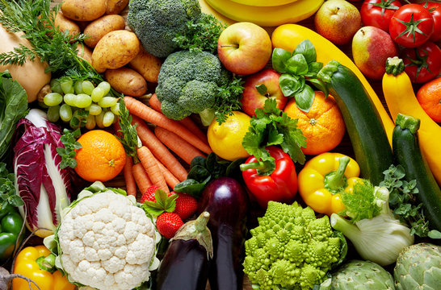

PREDICTING VEGETABLE SALES TREND

 
OVERVIEW

This project is addressing the issue of predicting sales trends for various vegetables sold across different retail chains. The goal is be to provide insights that can help these retail chains optimize their inventory management and pricing strategies.

BUSINESS PROBLEM 

Predicting the sales of specific vegetables based on historical data and current market conditions.

DATA UNDERSTANDING

For this Analysis i will be using Vegatable retail chain data from Kaggle using the link  [see link](https://www.kaggle.com/datasets/whikechen/simple-vegetable-sale,https://www.kaggle.com/code/ahmadwaleed1/vegetable-retail-chains-eda)

 
 Conclusion

 

1. Seasonal Trends:
   - The bar chart effectively illustrates seasonal patterns, allowing easy comparison of prices across seasons and different vegetable types.
   - Certain vegetables, such as tomatoes and peas, perform well during the monsoon season, while brinjal, ginger, and okra thrive in the summer.
   - Prices for different vegetables tend to peak during late summer and early monsoon seasons.
   - Onions exhibit higher prices during autumn.

2. Sales Patterns:
   - Lidi stands out with the highest sales of $4865.25, followed by Schwarz with $4697.35.
   - Sales generally increase from the 5th to the 15th month but start decreasing from the 20th to the 30th month.
   - Target has the lowest sales among the observed vendors.

3. Supplier Relationships:
   - Positive correlation between two suppliers suggests that when one has high sales, the other tends to have high sales as well.
   - Negative correlation, as seen with Metro and Walmart, indicates that when one supplier has high sales, the other tends to have low sales.

These conclusions provide a starting point for deeper analysis and potentially inform strategic decisions for businesses involved in the sale of vegetables. Further analysis and predictive modeling can be undertaken to develop a more comprehensive understanding of the factors influencing vegetable sales.

Recommendations/Implications

   - Businesses may want to adjust their inventory and marketing strategies based on seasonal variations, focusing on the specific vegetables that perform well during certain seasons.
   - Pricing strategies should take into account the observed peaks in vegetable prices during late summer and early monsoon seasons.
   - The decline in sales during the later months could prompt further investigation into potential factors affecting customer behavior.